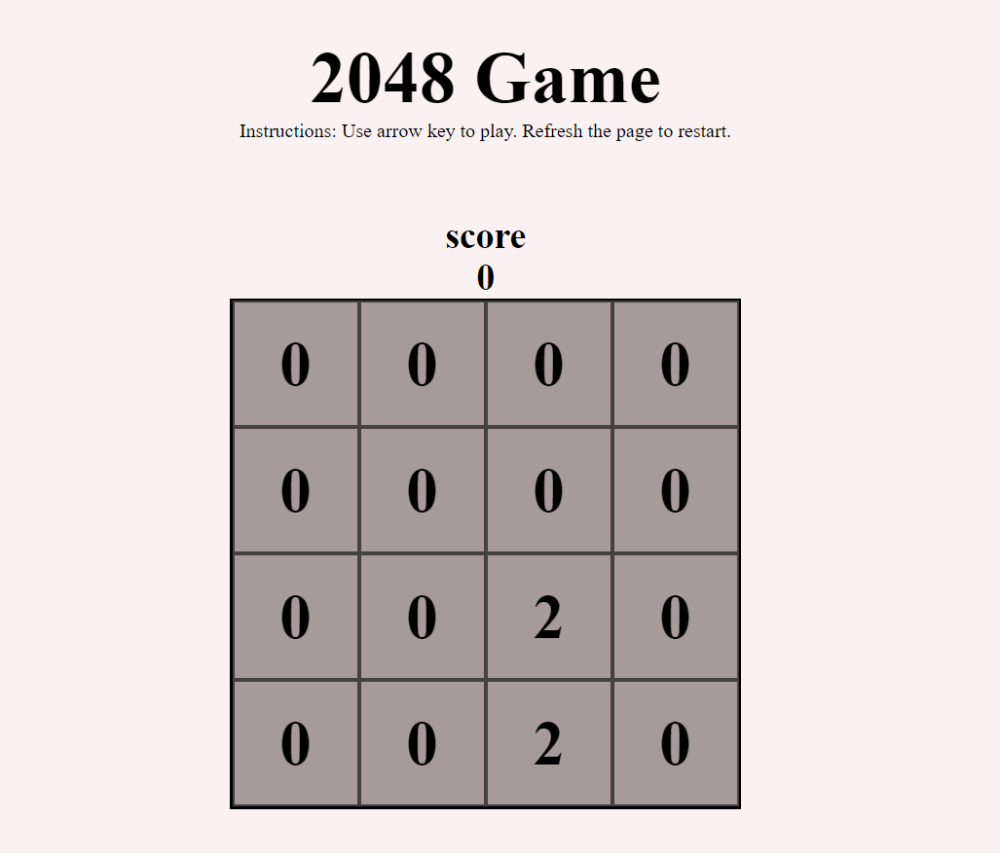

# 2048

A browser-based clone of the classic 2048 puzzle game, built with vanilla JavaScript — no frameworks, just the DOM.

🎮 **[Play it live](https://akshiit02.github.io/2048-Game/)**



## How it works

Merge matching tiles by sliding them with the arrow keys. Every move shifts the whole 4x4 grid, combines equal neighbors, and drops a new tile in — the score updates live as you go.

## Built with

- HTML5 / CSS3
- Vanilla JavaScript (grid logic, merge/collision detection, win/lose state)

## Run it locally

```bash
git clone https://github.com/akshiit02/2048-Game.git
cd 2048-Game
```
Open `index.html` in a browser — no build step needed.

## What I'd add next

- Touch/swipe support for mobile
- Persisted high score (`localStorage`)
- Tile slide/merge animations
